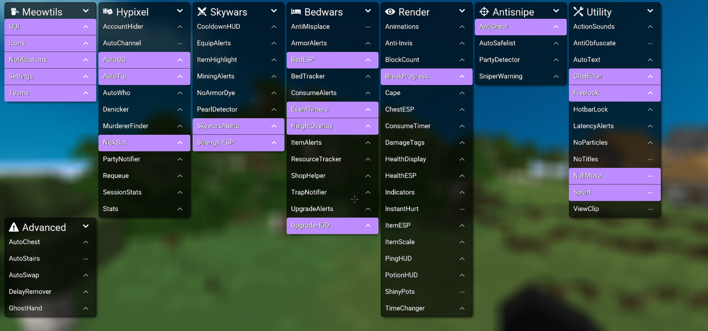

# Meowtils

## What is **Meowtils**?

**Meowtils** is a Minecraft utility mod with features that are focused towards specific servers and gamemodes, as well as general quality of life enhancements that can be useful anywhere.

## Supported Versions

- [x] **Forge 1.8.9**

- [x] **Lunar Client 1.8.9**

[Installation Guide](https://docs.tatp.wtf/guides/installation/)

## Features

**70+ Modules**  
For various gamemodes, servers, and just general QOL features.

**Ingame Stats**  
Like Hypixel stat overlays, but ingame.

**Clientside Anticheat**  
Detects if players around you use certain cheats.

**Personal Blacklist**  
Allows you to add players for any reason to your own blacklist, which will then alert you if you meet them ingame.

**Commands**  
A lot of commands for various things, such as quickly joining a game, checking player stats, or shortcuts for longer commands.

**Extensions**  
Like a small mod loaded by **Meowtils**, which lets you add your own features. Could be viewed as a powerful scripting API.

> [!TIP]
> For a full list of features check out [docs.tatp.wtf](https://docs.tatp.wtf/).

## Support

> [!NOTE]
> This requires you to [register a GitHub account](https://github.com/signup), alternatively you can join [Mega's Discord Server](https://discord.gg/XVrHPaMGGv) for support.

### Help

If you need help with anything you can ask [**HERE**](https://github.com/femboytatp/meowtils/discussions/categories/help).

### Suggestions

If you want to suggest a feature you can post a suggestion [**HERE**](https://github.com/femboytatp/meowtils/discussions/categories/suggestions).

### Bug reports

Report issues [**HERE**](https://github.com/femboytatp/meowtils/discussions/categories/bugs).

## Installation Guide

[Follow these steps.](https://docs.tatp.wtf/guides/installation/)

## Usage Guide

[Follow these steps.](https://docs.tatp.wtf/guides/basic-usage/)
